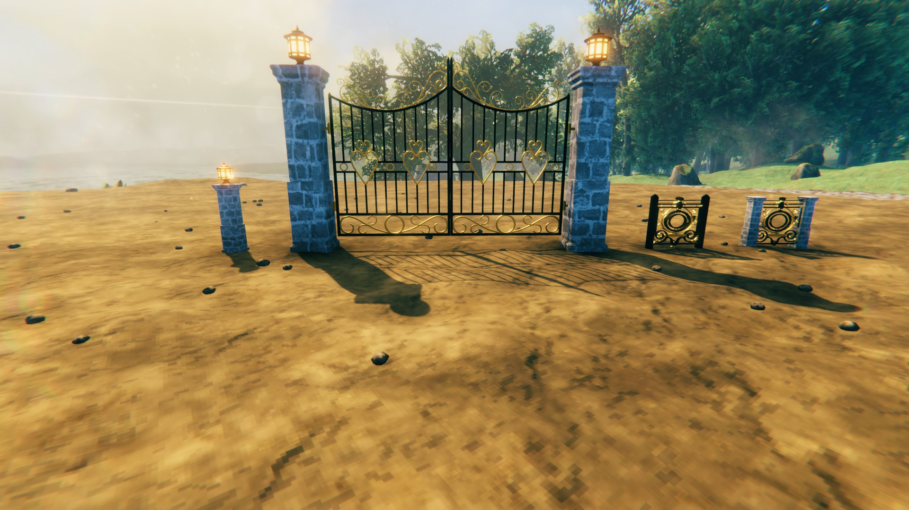
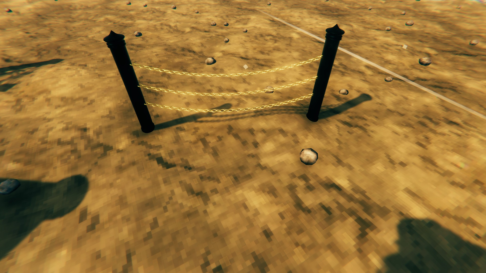
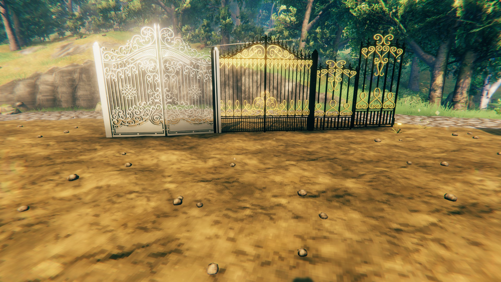
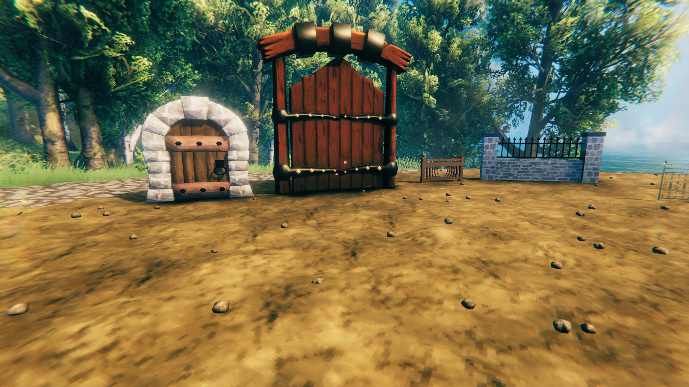
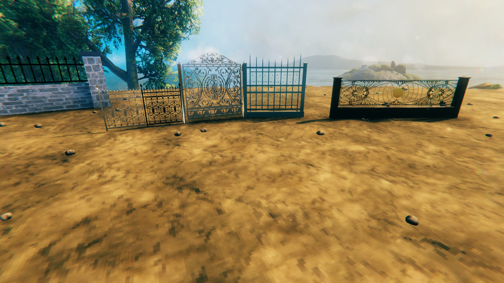

# Moonforged Gates & Fences

Moonforged Gates & Fences by **Caenos** adds custom buildable gates, fences, and walls with new resource costs, crafting stations, and proper multiplayer support.  
Includes placement tracking, asset bundle loading, and localization.

---

## Features

- **Custom Gates, Fences, and Walls**  
  High-quality, unique pieces to expand your building creativity.

- **Modern Crafting Requirements**  
  All build pieces use updated resources and require the correct crafting station (Forge, Black Forge, Workbench).

- **Multiplayer Friendly**  
  Properly syncs placement and destruction effects across servers.

- **AssetBundle Powered**  
  No extra downloads. Assets are included with the mod.

- **Full Localization Support**  
  Ready for English and other translations.

---

## Screenshots

---

## Installation

1. **Dependencies:**  
   - [BepInEx Pack](https://valheim.thunderstore.io/package/denikson/BepInExPack_Valheim/)  
   - [Jotunn](https://valheim.thunderstore.io/package/ValheimModding/Jotunn/)

2. **Mod Files:**  
   - Download this mod’s `.dll` and `gatesandfences` assetbundle.
   - Place both in:  
     `BepInEx/plugins/MoonforgedGatesAndFences/`

3. **Launch Valheim.**  
   - Find the new build pieces in your Hammer crafting menu!

---

## Credits

- **Mod Author:** Caenos  
- **Thanks:** Valheim modding community, [Jotunn](https://github.com/Valheim-Modding/Jotunn), [BepInEx](https://github.com/BepInEx/BepInEx)

---

## Support & Feedback

- [Thunderstore page](https://valheim.thunderstore.io/package/Caenos/MoonforgedGatesAndFences/)
- [GitHub issues](https://github.com/Caen007/MoonforgedGatesAndFences/issues)
- Or contact Caenos on Discord

---

Enjoy building with **Moonforged Gates & Fences**!
